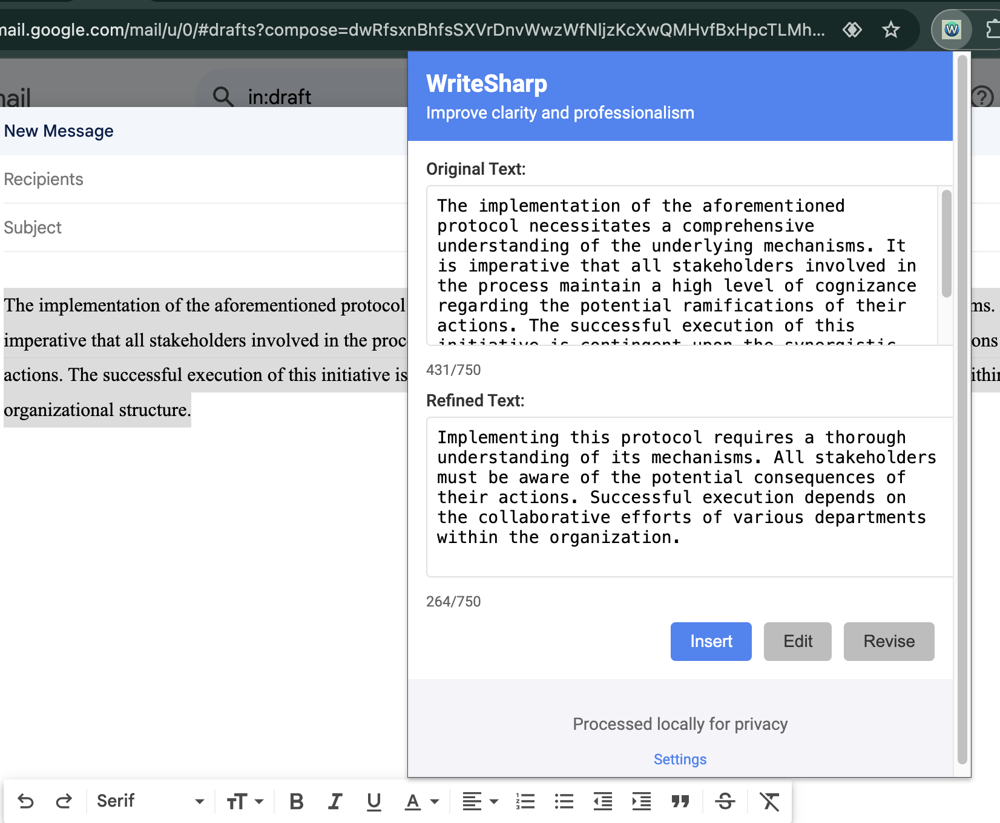

# WriteSharp

WriteSharp is an open-source Chrome extension that leverages AI to enhance the clarity and professionalism of written text across various web platforms. Designed for simplicity and efficiency, it offers on-the-fly text improvements for users who frequently write in online environments.

## Features

- **AI-Powered Enhancement**: Utilizes OpenAI's GPT models to refine selected text.
- **Seamless Browser Integration**: One-click activation and text replacement in web forms.
- **Customization**: Supports user-defined prompts for tailored refinements.
- **User-Friendly Interface**: Side-by-side comparison and in-place editing of refined text.
- **Privacy-Focused**: Secure API key management and local text processing.

Note: Currently not compatible with Google Docs, PowerPoint, or Excel.

WriteSharp is ideal for professionals, students, and anyone looking to improve their online writing quickly and effectively.

## How WriteSharp Works

WriteSharp simplifies the process of improving your text:

1. Select text on any webpage.
2. Click the WriteSharp icon to launch the popup.
3. Review the original and AI-refined versions side-by-side.
4. Optionally edit the refined text.
5. Click 'Insert' to replace the original text.

Here's an example of WriteSharp in action:



WriteSharp transforms complex, wordy text into clear, concise language - ideal for emails, reports, or any written communication.

## Installation

### Prerequisites

- Node.js (version 14.0 or higher)
- npm (usually comes with Node.js)
- Google Chrome browser

### Setup Steps

1. **Clone the repository:**


## Installation

Currently, WriteSharp supports manual installation only. Follow these steps to set up the extension on your local machine:

1. **Clone the Repository**

```
git clone https://github.com/adurafayode/writesharp.git
cd writesharp
```

2. **Install Dependencies**

```
npm install
```

3. **Configure the Server**

* Open the project in your preferred code editor.
* Copy `.env.example` to `.env` and update the values as needed.
* Navigate to `server.js` in the root directory.
* (Optional) The default port is set to 4000. If you wish to change the default, modify `PORT` in `.env`, `BACKEND_URL` in `src/background.js`, and `content_security_policy` in `manifest.json`.

4. **Start the Server**

```
node server.js
```

5. **Load the Extension in Chrome**

- Open Chrome and navigate to `chrome://extensions/`
- Enable "Developer mode" (toggle in top right)
- Click "Load unpacked"
- Select the `writesharp` directory you cloned in step 1. 

6. **Verify Installation**

* You should now see the WriteSharp icon in your Chrome extensions toolbar.
* Click on the icon to open the popup and start using WriteSharp!

> Note: Keep the local server running while using the extension. If you close the terminal or restart your computer, you'll need to start the server again (step 4).

### Troubleshooting

- If the extension doesn't load, try refreshing the `chrome://extensions/` page and reloading the unpacked extension.
- Ensure your Node.js version is compatible with the project requirements.
- For any server-related issues, check the console where you're running `server.js` for error messages.

## Configuration Options

### API Key Setup
1. Click the 'Settings' link in the WriteSharp popup.
2. Enter your OpenAI API key.
3. Click 'Save API Key'.

> **Important:** Keep your API key confidential. Never share it publicly or with unauthorized individuals.

### Custom Prompts
1. In the Settings menu, locate the 'Custom Prompt' section.
2. Enter your desired prompt in the text area and save.
3. Toggle 'Use Custom Prompt' to activate your custom instructions.

### Default Prompts
WriteSharp uses two default prompts:

1. **System Prompt:**

```
You are WriteSharp, an AI that enhances text clarity and professionalism. Rephrase input text, maintaining original intent. Provide only the enhanced version.
```

2. **User Prompt:**

```
Improve the following text with these guidelines:

- Simplify complex sentences
- Use precise, professional language
- Ensure consistent tone and improved flow
- Correct grammar and punctuation
- Adapt to professional contexts

Input text:
```

Note: Custom prompts modify only the user prompt. For system prompt changes, edit the `systemPrompt` variable in `server.js`.

### AI Model Parameters
- Current model: GPT-4o
- Temperature: 0.7

To modify these settings, edit the `createChatCompletion` method in `server.js`.

## Contributing

We welcome contributions to WriteSharp! Here's how you can help:

1. **Report Issues**: Use GitHub Issues for bugs or enhancement suggestions.

2. **Submit Pull Requests**: 
   - Fork the repo and create your branch from `main`.
   - Ensure code adheres to the existing style.
   - Include tests for new features.
   - Update documentation as needed.

3. **Development Setup**: Refer to the [Installation](#installation) section.

For major changes, please open an issue first to discuss your ideas.

By contributing, you agree to abide by the project's code of conduct (to be implemented).

## Contact Information

For questions, suggestions, or discussions about WriteSharp, you can reach out to the project maintainer:

- X (Twitter): [@Adurex](https://x.com/Adurex)

Feel free to send a direct message or mention @Adurex in a tweet related to WriteSharp.