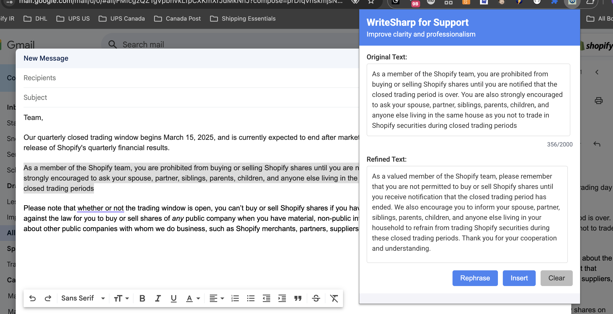

# WriteSharp

WriteSharp is a Chrome extension that helps anyone improve clarity and tone in text areas on the web. It provides quick, AI-assisted rewrites that preserve your meaning while enhancing readability and professionalism.

## Features

- **AI-powered rewriting** using your own OpenAI API key
- **One-click rephrase** from a popup, with side-by-side comparison
- **Preserves structure** (lists, paragraphs) and factual details
- **Copy-to-clipboard workflow** for strict editors; direct insert where allowed
- **Custom prompts and model selection** (e.g., GPT-4o, GPT-4o-mini, GPT-3.5-turbo)
- **Local storage** for settings via `chrome.storage.sync`

Note: Google Docs is not currently supported.

## How it works

1. Select text on any supported site.
2. Open the WriteSharp popup to review the selected text.
3. Choose a model and optionally a custom prompt.
4. Click Rephrase to generate an improved version.
5. Insert the refined text back into the page or copy it if insertion is restricted.

## Installation

### Load unpacked (development)

1. Download or clone this repository.
2. Open Chrome and go to `chrome://extensions/`.
3. Enable Developer mode.
4. Click "Load unpacked" and select the project root directory (the folder containing `manifest.json`).

### Chrome Web Store (optional)

If/when published, this section will include a link to the store listing.

## Permissions

WriteSharp requests a minimal set of permissions to operate:

- `activeTab`, `scripting`, and `storage`
- Site matches for common editors (e.g., Gmail, Slack, GitHub, Zendesk) to enable selection and insertion

You can review and adjust host permissions in `manifest.json`.

## Configuration

- API key: Add your OpenAI API key in the popup settings. It is stored via `chrome.storage.sync` on your Chrome profile and used only to call the OpenAI API from the extension.
- Model selection: Choose from GPT-4o, GPT-4o-mini, or GPT-3.5-turbo (availability may change over time).
- Custom prompt: Provide optional instructions to guide rewriting style.

## Privacy & Security

- Your selected text is sent to the OpenAI API endpoint you configure (default: `https://api.openai.com/v1/chat/completions`).
- The API key is stored using `chrome.storage.sync` and is not transmitted anywhere except to the configured API endpoint for your requests.
- No telemetry is collected by this extension.

For stricter environments, you can use your own proxy endpoint and update the endpoint in `src/background.js` (and the CSP in `manifest.json`).

## Platform compatibility

- Direct insert (typical): Gmail, Slack, GitHub, and other standard textareas/contenteditables
- Copy-to-clipboard mode: Editors with strict policies (e.g., Zendesk)
- Not supported: Google Docs and some locked-down web editors

WriteSharp detects the editor type and will prompt for the most compatible action.

## Development

- Prerequisites: Recent Node.js and npm (for any tooling you may add). No build step is required.
- Code location: Background and content scripts in `src/`, popup UI in `src/public/popup/`.
- Load via `chrome://extensions` → Load unpacked.

## Contributing

Contributions are welcome! Standard GitHub flow:

1. Fork the repo and create a branch.
2. Make your changes with clear commits.
3. Open a pull request against `main` with a concise description.

Code style:

- Keep functions focused and readable.
- Use descriptive names.
- Prefer minimal and explicit permissions.

## License

MIT License. See `LICENSE` for details.
